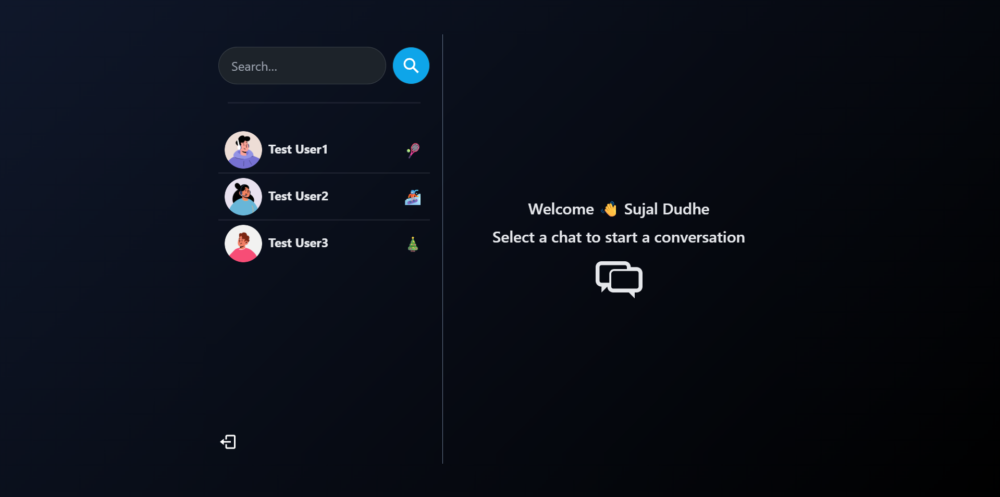

# Real-Time Chat App

[](https://realtime-chat-app-cs5m.onrender.com)

A full-stack real-time messaging application built with the **MERN** stack (MongoDB, Express.js, React, Node.js) and powered by **Socket.io** for instant communication. This application features a modern UI styled with **Tailwind CSS** and **DaisyUI**, focusing on performance, responsiveness, and a premium user experience.
## 

## ✨ Features

- **Real-time Messaging**: Send and receive messages instantly.
- **Authentication**: Secure Signup and Login using JWT.
- **Online Status**: See which users are currently online.
- **Global State Management**: Efficient state handling with Zustand.
- **Responsive Design**: Optimized for desktop and mobile views.
- **Modern UI**: Built with Tailwind CSS and DaisyUI glassmorphism.

---

## 🚀 Technologies Used

- **MongoDB**: NoSQL database for storing messages and user data.
- **Express**: Backend web application framework for Node.js.
- **React**: Frontend library for building user interfaces.
- **Node.js**: JavaScript runtime for the backend.
- **Socket.io**: Library for real-time, bidirectional communication.
- **Tailwind CSS**: Utility-first CSS framework for styling.
- **DaisyUI**: Component library for Tailwind CSS.
- **Zustand**: Lightweight state management for React.
- **Vite**: Fast frontend build tool.

---

## 🏁 Getting Started

### Prerequisites

- Node.js and npm installed on your machine.
- MongoDB connection URI (Local or Atlas).

### Installation & Setup

1.  **Clone the repository:**
    ```bash
    git clone https://github.com/Sujal-Dudhe/Realtime-chat-app
    ```
2.  **Navigate to the project directory:**
    ```bash
    cd RealTime-Chat-App
    ```
3.  **Install backend dependencies:**
    ```bash
    npm install
    ```
4.  **Install frontend dependencies:**
    ```bash
    npm install --prefix frontend
    ```
5.  **Create a `.env` file** in the root directory and add your configuration:
    ```env
    PORT=5000
    MONGO_DB_URI=your_mongodb_uri
    JWT_SECRET=your_jwt_secret
    NODE_ENV=development
    ```

---

## Run this app locally

```bash
    npm run build
```

## Start the app

```bash
    npm run start
```

---

## 🔧 API Endpoints

The following API endpoints are available:

| Method | Endpoint                 | Description                     |
| ------ | ------------------------ | ------------------------------- |
| `POST` | `/api/auth/signup`       | Register a new user.            |
| `POST` | `/api/auth/login`        | Login an existing user.         |
| `POST` | `/api/auth/logout`       | Logout the user.                |
| `GET`  | `/api/messages/:id`      | Get conversation with a user.   |
| `POST` | `/api/messages/send/:id` | Send a message to a user.       |
| `GET`  | `/api/users`             | Get specific users for sidebar. |

---

## 📂 Project Structure

```bash
RealTime-Chat-App/
├── backend/                   # Backend (Node.js/Express)
│   ├── controllers/           # Business logic
│   │   ├── auth.controller.js
│   │   ├── message.controller.js
│   │   └── user.controller.js
│   ├── db/                    # Database connection
│   │   └── connectToMongoDB.js
│   ├── middleware/            # Custom middleware
│   │   └── protectRoute.js
│   ├── models/                # Database models
│   │   ├── conversation.model.js
│   │   ├── message.model.js
│   │   └── user.model.js
│   ├── routes/                # API endpoints
│   │   ├── auth.route.js
│   │   ├── message.route.js
│   │   └── user.route.js
│   ├── socket/                # Socket.io configuration
│   │   └── socket.js
│   ├── utils/                 # Utilities
│   │   └── generateToken.js
│   └── server.js              # Server entry point
│
├── frontend/                  # Frontend (React + Vite)
│   ├── public/                # Static assets
│   ├── src/                   # Source code
│   │   ├── assets/            # Images/sounds
│   │   ├── components/        # UI components
│   │   │   ├── messages/
│   │   │   └── sidebar/
│   │   ├── context/           # React Context
│   │   │   ├── AuthContext.jsx
│   │   │   └── SocketContext.jsx
│   │   ├── hooks/             # Custom React hooks
│   │   ├── pages/             # Page components
│   │   │   ├── home/
│   │   │   ├── login/
│   │   │   └── signup/
│   │   ├── zustand/           # State management
│   │   │   └── useConversation.js
│   │   ├── App.jsx            # Root component
│   │   └── main.jsx           # Entry point
│   ├── eslint.config.js       # Linting config
│   ├── index.html             # Main HTML
│   ├── package.json           # Frontend dependencies
│   └── vite.config.js         # Vite config
│
├── .env                       # Environment variables
├── .gitignore                 # Global ignore rules
├── package.json               # Root dependencies (Backend + Scripts)
└── package-lock.json          # Lock file
```
